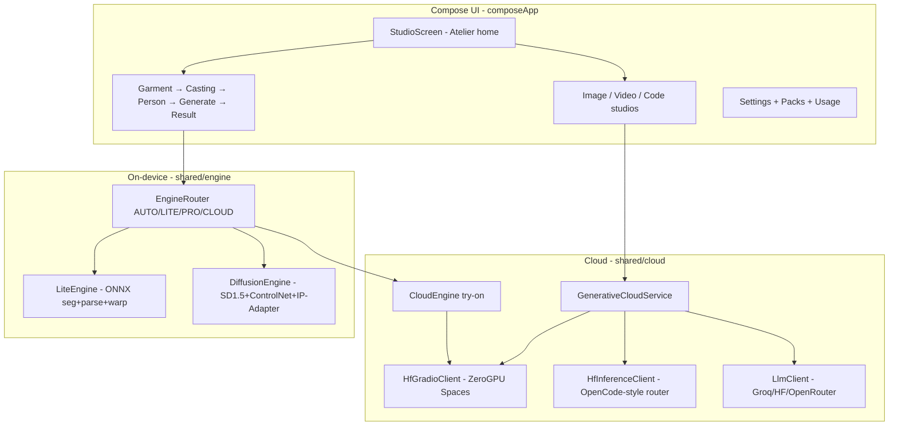

# The Lookbook — Models, Tools, UI & Deep-Dive Roadmap

> **Location:** `docs/plans/claude-code-expansion/PLAN.md` (Claude Code improvement plan).  
> **Note:** Baseline v2.9.5 when authored. v3.0.0 shipped `HomeScreen` + settings hub — replace `StudioScreen` / `CreateStudioScreen` references with home pager + `UnifiedStudioPane`. Overlaps with [`../lookbook-v3-followup/PLAN.md`](../lookbook-v3-followup/PLAN.md) on packs and settings.

## What this app is (deep understanding)

**The Lookbook** (`com.zakir.vestra`) is a modest-wear AI studio: garment photo → photorealistic model shots (abaya, hijab, niqab, shalwar kameez, etc.). It has **two parallel AI systems**:

**Privacy invariant:** Cloud never auto-runs — user picks `EngineTier.CLOUD` or uses cloud studios explicitly ([`EngineRouter.kt`](shared/src/commonMain/kotlin/com/zakir/vestra/shared/engine/EngineRouter.kt)).

**Key insight from recent work:** HF has **two separate quotas**:
- **ZeroGPU Spaces** (`*.hf.space`) — try-on, image edit, video; often empty-error when spent
- **Inference Providers** (`router.huggingface.co`) — what OpenCode uses; FLUX text-to-image works via nscale even when Spaces fail ([`HfInferenceClient.kt`](shared/src/commonMain/kotlin/com/zakir/vestra/shared/cloud/HfInferenceClient.kt))

---

## Current model inventory

### Cloud ([`CloudModelCatalog.kt`](shared/src/commonMain/kotlin/com/zakir/vestra/shared/cloud/CloudModelCatalog.kt))

| Capability | Working path today | Fragile / blocked |
|------------|-------------------|-------------------|
| **Image gen** | FLUX Inference (nscale), FLUX Space | SDXL Lightning Space (degraded) |
| **Image edit** | Qwen Space, InstructPix2Pix Space | No HF Inference edit yet |
| **Code** | OpenRouter free, Groq (if key), HF Qwen Coder | HF chat 402 when monthly credits spent |
| **Try-on** | OOTDiffusion Space | FitDiT (needs mask UI), IDM/CatVTON (degraded) |
| **Video** | LTX ZeroGPU Space | Wan2 (queue full) |

### Local ([`LocalModelCatalog.kt`](shared/src/commonMain/kotlin/com/zakir/vestra/shared/local/LocalModelCatalog.kt))

| Pack | Size | Status |
|------|------|--------|
| `lite-v1` | ~68 MB | Runnable — U²-Net seg + SCHP parse ([`LiteEngine.kt`](shared/src/androidMain/kotlin/com/zakir/vestra/shared/engine/lite/LiteEngine.kt)) |
| `pro-v2-int8` | ~2 GB | Script ready; needs HF hosting |
| `pro-v1` | ~4.3 GB | FP16 fallback |
| `studio-models-v1` | ~50–200 MB | Casting gallery photos |
| Quality packs | planned | BiRefNet, Real-ESRGAN, GFPGAN — not shipped |

Build pipeline: [`ml/convert_pro_pack.py`](ml/convert_pro_pack.py), [`ml/export_lite_pack.py`](ml/export_lite_pack.py), manifest at `Iamzakirzr/vestra-packs`.

---

## Recommended models to add

### Cloud — high value, fits existing clients

**Image (HF Inference Providers — extend [`HfInferenceClient.kt`](shared/src/commonMain/kotlin/com/zakir/vestra/shared/cloud/HfInferenceClient.kt))**
- `stabilityai/sdxl-turbo` — fast T2I via nscale (already probed in dev)
- `Tongyi-MAI/Z-Image-Turbo` — already in catalog, fal-ai queue route
- Image-to-image / edit: probe `timbrooks/instruct-pix2pix` or HF `image-to-image` warm models via provider mapping API

**Code (extend [`LlmClient.kt`](shared/src/commonMain/kotlin/com/zakir/vestra/shared/cloud/LlmClient.kt) + catalog)**
- `Qwen/Qwen2.5-Coder-7B-Instruct` — already added; use as primary when 32B hits 402
- Router discovery from `GET router.huggingface.co/v1/models` — populate picker like OpenCode `/models` ([`FreeCloudDiscovery.kt`](shared/src/commonMain/kotlin/com/zakir/vestra/shared/cloud/FreeCloudDiscovery.kt) currently returns empty for all capabilities)
- Provider suffixes: `:fastest`, `:cheapest` for auto-routing

**Try-on (HF Spaces — [`SpacePayloads.kt`](shared/src/commonMain/kotlin/com/zakir/vestra/shared/cloud/SpacePayloads.kt))**
- **Leffa** (`leffa-hf`) — MIT-licensed, commercial-friendly candidate per [`docs/OPENSOURCE_OPPORTUNITIES.md`](docs/OPENSOURCE_OPPORTUNITIES.md)
- Re-audit OOTD/IDM live schemas quarterly; keep `CloudModelContracts` in sync

**Video**
- Keep LTX as default; add HF Inference text-to-video when a stable free provider appears (Wan2 Space too queue-sensitive)

### Local — on-device expansion

**Phase A — Quality post-processing packs (biggest quality win, small size)**
- `birefnet-v1` — replace u2netp in Lite seg path ([BiRefNet](https://huggingface.co/ZhengPeng7/BiRefNet))
- `realesrgan-v1` — 512 gen → 2×/4× upscale after try-on/create ([`LocalModelCatalog.kt`](shared/src/commonMain/kotlin/com/zakir/vestra/shared/local/LocalModelCatalog.kt) already reserved)
- `gfpgan-v1` — face restore on person-source try-ons

**Phase B — Pro pack shipping**
- Host `pro-v2-int8` on HF dataset; verify manifest URL resolves (was 503 in past audits)
- CI step: `ml/export_lite_pack.py` → debug assets so fresh clones work offline

**Phase C — Speed (reference: Local Dream app)**
- QNN execution provider in [`OrtGraph.kt`](shared/src/androidMain/kotlin/com/zakir/vestra/shared/engine/pro/OrtGraph.kt) — NPU on Snapdragon
- LCM/Hyper-SD distillation before export — 4–8 steps instead of 20+

**Phase D — Future local studios**
- `local-flux-schnell` pack for offline Create Studio (1–3 GB) — research only today
- Small coder via ExecuTorch/MediaPipe (`local-coder-v1`) — offline Code Studio

---

## Tools & infrastructure to add

| Tool | Purpose | Where |
|------|---------|-------|
| **`scripts/probe-models.py`** (exists) | Extend with HF router model list + inference edit probes | CI nightly smoke |
| **Model health dashboard** | Surface Ready/Degraded/402 in Usage screen | [`UsageScreen.kt`](composeApp/src/main/kotlin/com/zakir/vestra/ui/screens/usage/UsageScreen.kt) |
| **HF router discovery job** | On token save, fetch usable models → `AppSettings.rememberDiscovered()` | [`FreeCloudDiscovery.kt`](shared/src/commonMain/kotlin/com/zakir/vestra/shared/cloud/FreeCloudDiscovery.kt) |
| **Pack verify CLI** | `ml/manifest_gen.py` + sha256 check before publish | Release gate |
| **Visual regression** | [`scripts/visual-verify.sh`](scripts/visual-verify.sh) + screenshot diff | QA |
| **Compose UI tests** | 0 today — add for Settings tier + Generate flow | `composeApp/src/androidTest` |
| **Docs refresh** | Fix stale "cloud removed" in [`docs/PROJECT_STATUS.md`](docs/PROJECT_STATUS.md) | Align with v2.9.x |

External free tools worth integrating (from [`docs/OPENSOURCE_OPPORTUNITIES.md`](docs/OPENSOURCE_OPPORTUNITIES.md)):
- **Qualcomm AI Hub** — compile ONNX → QNN for NPU
- **Google Colab notebook** — already have [`ml/colab_convert_pro_pack.ipynb`](ml/colab_convert_pro_pack.ipynb)
- **Modal** — bursty GPU for pack conversion (optional)

---

## UI cleanup opportunities

Settings is ~1100 lines and dense ([`SettingsScreen.kt`](composeApp/src/main/kotlin/com/zakir/vestra/ui/screens/settings/SettingsScreen.kt)). Recommended UX splits:

1. **Atelier home** ([`StudioScreen.kt`](composeApp/src/main/kotlin/com/zakir/vestra/ui/screens/studio/StudioScreen.kt))
   - Show engine status pill (Lite ready / Pro needs download / Cloud needs token)
   - "Recent looks" carousel with tap-to-retry generation params
   - One-tap "Generate with best available model" for Image studio

2. **Settings restructure**
   - Tab or sections: **Engines & Packs** | **Cloud Models & Keys** | **Appearance & Privacy**
   - Unified model browser: local packs + cloud models in one searchable list ([`ModelPickerSheet.kt`](composeApp/src/main/kotlin/com/zakir/vestra/ui/components/ModelPickerSheet.kt) pattern)
   - Token setup wizard (HF → Groq → OpenRouter) with OpenCode-style copy

3. **Generation feedback** ([`CreateStudioScreen.kt`](composeApp/src/main/kotlin/com/zakir/vestra/ui/screens/create/CreateStudioScreen.kt), [`GenerativeViewModel.kt`](composeApp/src/main/kotlin/com/zakir/vestra/ui/GenerativeViewModel.kt))
   - Show which model actually ran (after fallback)
   - Actionable errors: "Switch to FLUX Inference" / "Add Groq key" / "Download Lite pack"
   - Preflight chip in composer bar before Send

4. **Try-on flow polish**
   - Pack download CTA inline on Generate when Pro unavailable
   - FitDiT: either hide or add minimal mask editor (unblocks highest-quality cloud try-on)

5. **Theme consistency** ([`Theme.kt`](composeApp/src/main/kotlin/com/zakir/vestra/ui/theme/Theme.kt))
   - Midnight Saffron is established; reduce duplicate glass cards, tighten spacing on small screens
   - Settings scroll performance (already avoided nav animations for ANR — keep flat lists)

---

## Phased implementation plan

### Cycle 1 — Make generation reliably work (models)
- Enable HF router discovery for CODE + IMAGE_GEN in [`FreeCloudDiscovery.kt`](shared/src/commonMain/kotlin/com/zakir/vestra/shared/cloud/FreeCloudDiscovery.kt)
- HF Inference image-to-image for edit studio (extend `HfInferenceClient`)
- Auto-pick best code model when HF 402 (prioritize OpenRouter → Groq → HF 7B)
- Re-probe all Spaces; update [`CloudModelContracts.kt`](shared/src/commonMain/kotlin/com/zakir/vestra/shared/cloud/CloudModelContracts.kt)
- Expand [`scripts/probe-models.py`](scripts/probe-models.py) as CI gate

### Cycle 2 — Local quality & packs
- Ship `birefnet-v1` + `realesrgan-v1` ONNX packs via `ml/export_*.py`
- Wire post-process pipeline in [`LiteEngine.kt`](shared/src/androidMain/kotlin/com/zakir/vestra/shared/engine/lite/LiteEngine.kt) / [`DiffusionEngine.kt`](shared/src/androidMain/kotlin/com/zakir/vestra/shared/engine/pro/DiffusionEngine.kt)
- Publish `pro-v2-int8` to HF; fix manifest 503
- Ensure debug lite assets in CI ([`DebugPackBootstrap.kt`](composeApp/src/main/kotlin/com/zakir/vestra/DebugPackBootstrap.kt))

### Cycle 3 — Cleaner UI
- Split Settings into sub-screens
- Model health + "what ran" in Usage and studio result cards
- Token setup wizard; composer preflight chips
- Optional: FitDiT mask editor (large scope)

### Cycle 4 — Speed & polish
- QNN EP in ORT; LCM 4-step Pro pack
- Compose UI tests for critical paths
- Play compliance: input safety classifier ([`docs/PLAY_COMPLIANCE.md`](docs/PLAY_COMPLIANCE.md))
- Docs refresh (ARCHITECTURE, PROJECT_STATUS, README cloud section)

---

## Working ideas worth pursuing

1. **"Best available" button** — EngineRouter + CloudModelRouting pick Lite → Pro → Cloud Inference → Space automatically with clear UX
2. **OpenCode parity** — HF token + router model list in Settings; same models user sees in OpenCode
3. **512 → ESRGAN pipeline** — catalog-grade output without 1024 diffusion cost
4. **Leffa as commercial cloud try-on** — MIT weights, better license story than OOTD
5. **Shoot mode** — batch generate N casting variants locally (Pro) with InstantID face lock (future)
6. **Seller listing export** — Real-ESRGAN + watermark + EXIF provenance ([`AndroidCloudIo.kt`](shared/src/androidMain/kotlin/com/zakir/vestra/shared/cloud/AndroidCloudIo.kt) already stamps cloud outputs)

---

## Honest limits

- **ZeroGPU Spaces** share daily GPU minutes — cannot guarantee all Space models 24/7
- **HF Inference** has monthly credits — separate from ZeroGPU; resets monthly
- **Local video / large local LLM** impractical on phones today
- **FitDiT / mask try-on** needs UI investment before the model works
- **VTON-dataset models** (IDM, OOTD) may have non-commercial weight restrictions — Pro SD path is the commercial-safe on-device route
